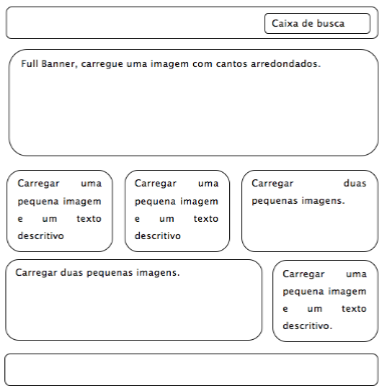

# Laboratório 1  
## A 
-  1. Utilizando o wireframe a seguir, crie um arquivo chamado home.html e um arquivo para folha de estilos denominado estilo.css de forma que produza o seguinte resultado:  

