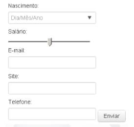
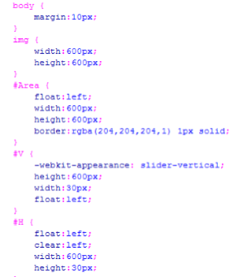

# Laboratório 1 
## A 
-   Criando um formulário com elementos da HTML5
1. Crie um arquivo HTML com o nome de formulário.html;
2. Adicione a estrutura básica de elementos HTML no arquivo;
3. No elemento BODY, adicione o elemento FORM;
4. Adicione o elemento LABEL com o texto Nascimento:;
5. Adicione o elemento INPUT com o atributo TYPE igual a DATE;
6. Adicione o elemento LABEL com o texto Salário:;
7. Adicione o elemento INPUT com o atributo TYPE igual a RANGE, o atributo MIN igual a 0 e o atributo MAX igual 10000;
8. Adicione o elemento LABEL com o texto E-mail:;
9. Adicione o elemento INPUT com o atributo TYPE igual a EMAIL;
10. Adicione o elemento LABEL com o texto Site:;
11. Adicione o elemento INPUT com o atributo TYPE igual a URL;
12. Adicione o elemento LABEL com o texto Telefone:;
13. Adicione o elemento INPUT com o atributo TYPE igual a TEL e crie uma expressão regular para validar o valor inserido;
14. Adicione o elemento BUTTON com a classe btn, o atributo TYPE igual a SUBMIT e o texto Enviar. O resultado final será este:

## B 
- Criando um formulário de autenticação com múltiplos destinos
1. Crie um arquivo HTML com o nome de login.html;
2. Adicione a estrutura básica de elementos HTML no arquivo;
3. No elemento BODY, adicione o elemento FORM com os atributos ACTION igual a aluno.php e METHOD igual a POST;
4. Adicione o elemento INPUT com o atributo TYPE igual a EMAIL e o atributo PLACEHOLDERigual a E-mail;
5.  Adicione  o  elemento  INPUT  com  o  atributo  TYPE  igual  a  PASSWORD  e  o  atributo  PLACEHOLDER igual a Senha;
6. Adicione o elemento BUTTON com o atributo TYPE igual a SUBMIT e o texto Login Aluno;
7. Adicione o elemento BUTTON com o atributo TYPE igual a SUBMIT, o atributo FORMACTION igual a instrutor.php e o texto Login Instrutor. O resultado será como mostrado a seguir:

## C
- Utilizando campos range para ajustar a largura e a altura de uma imagem
1. Crie um arquivo HTML com o nome de ajustar_imagem.html;
2. Adicione a estrutura básica de elementos HTML no arquivo;
3. Adicione os seguintes estilos CSS:

4. Crie um elemento DIV com o ID igual a Area e insira um elemento IMG nesse DIV com o SRC igual a HTML5-Logo.png;
5. Crie dois elementos INPUT do tipo RANGE com os atributos MAX e VALUE iguais a 600 e MIN igual 0. O primeiro INPUT deverá ter o ID igual a V e o segundo igual a H;
6. Crie um elemento SCRIPT;
7. Crie uma variável com o nome ranges e selecione todos os elementos em que o TYPE for igual a RANGE;
8. Percorra os elementos selecionados e adicione o evento change a cada um deles;
9. No evento, crie uma variável com o nome imgStyle que receberá a seleção do atributo styledo elemento IMG;
10. Crie uma nova variável com o nome size e defina o valor igual ao atributo value do objeto this concatenado com a string px;
11. Verifique se o ID do objeto this é igual a V. Se a condição for verdadeira, atribua a variável size ao atributo height da variável imgStyle. Senão, atribua ao atributo width. O resultado será este:
